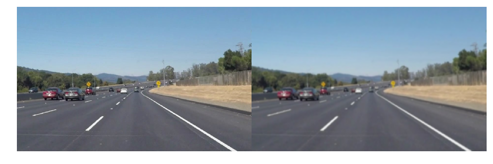
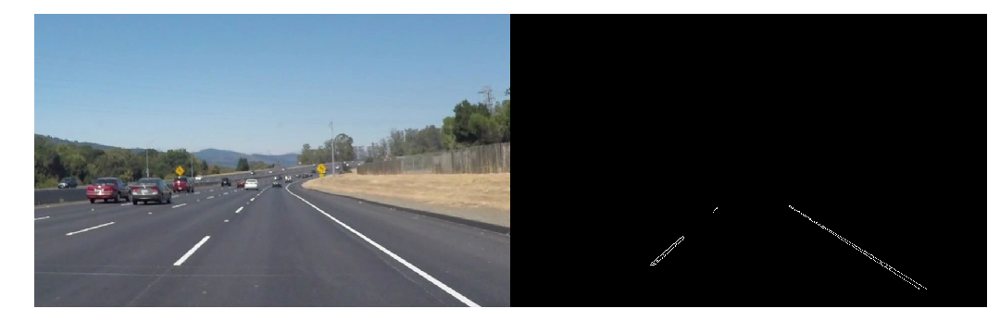
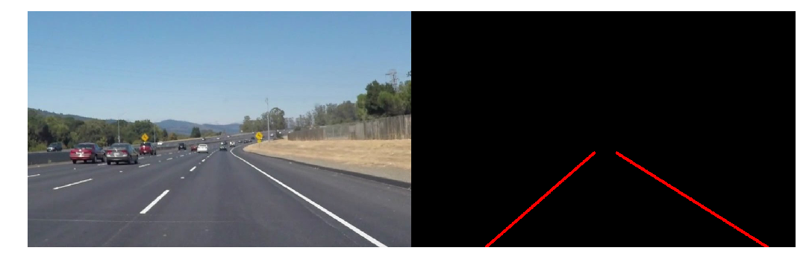
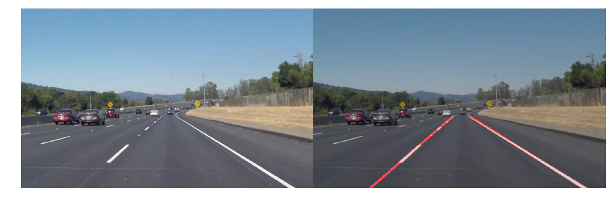

# **Finding Lane Lines on the Road**

## Writeup Template

### You can use this file as a template for your writeup if you want to submit it as a markdown file. But feel free to use some other method and submit a pdf if you prefer.

---

**Finding Lane Lines on the Road**

The goals / steps of this project are the following:
* Make a pipeline that finds lane lines on the road
* Reflect on your work in a written report

---

### Reflection

### 1. Pipeline description

My pipeline consisted of 5 steps:

1. **Preprocessing**: at this step the image is preprocessed for easier extraction of the information.
First the image is blurred in order to get rid of high frequency components in the image.
The blurring is done with 11x11 kernel.
After that only relevant color information is extracted.
This performed by analyzing the image, and getting information in the range of colors.
The ranges that were used for this project were `([0x93, 0x71, 0x06], [0xf9, 0xd7, 0x67])` (yellow range) and `([0xe7, 0xd3, 0xb1], [0xff, 0xff, 0xff])` (white range).

2. **Canny**: The edge detection at this stage is fairly easy, and after running the `cv2.canny` with the low threshold at `50` and the high threshold at `100` we can get the edges of the image.

3. **Region of Interest**: Because we are only interested in the lanes, we can just cut off any information about the edges outside certain region of the image. For this project I found the the following vertices are good: `((0.1, 0.94), (0.45, 0.63), (0.57, 0.63), (0.9, 0.94))`.
The vertices are represented as ratios with respect to `x`, `y` size of the image.

4. **Hough**: Once we get the points on the lane, we can extract the lines, and get the start/end points of them using hough transform.

 1. _Hough parameters_: The parameters that were used for the transform are `rho = 1, theta = pi/90, threshold = 20, min_line_len=30, max_line_len=25`.
 This is very aggressive, because it limits the possible lines to very narrow set of conditions: the angle is limited to 2 degress and the minimum line length is limited to 30.
 This causes some lane markers not to be detected, especially in the very close conditions (i.e. white lane on white road).
 2. *`draw_lines`*: This is where all the magic happens.
 First, `draw_lines` separates the lanes based on their slope: for some positive `reject`, the slope is considered to be on the right if `slope >= reject`.
 If `slope <= -reject` it is considered to be the left line.
 The greater is the `reject` the more prominent should be the line (going into horizon) in order for it to be considered.
 3. _`memory` (IIR filter)_: `draw_line` routine has some memory about previously detected lanes.
 The currently detected line is `70%` currently detected and `30%` memory (as specified in the `draw_line`).
 This allows for the lines to be smooth, and mitigates any issues with outliers and artifacts.
5. Now that the lines are detected, we superimpose them with the original image

### 2. Identify potential shortcomings with your current pipeline

- One possible shortcoming is disability of my approach to detect lanes of arbitrary colors.
Because I filter out all colors not in the current lane-color-space, if the lanes are, say, red the method will fail miserably.
- Also, the memory implementation is very naïve: It's a simple IIR with its memory weight set to `0.3`.
In reality the memory effect on the current detection should be more dynamic.
In the current implementation, if something immediate happens (i.e. sharp turn), the current memory implementation will prevent correct lane detection.

### 3. Suggest possible improvements to your pipeline

1. FIR filter would be much better in the `draw_lines` routine.
The reason is that IIR has infinitely long memory about lines, which might potentially cause problems.
2. Color detection would be more robust if working in HSV space -- currently we look at the colors, but hue might be a better predictor.
